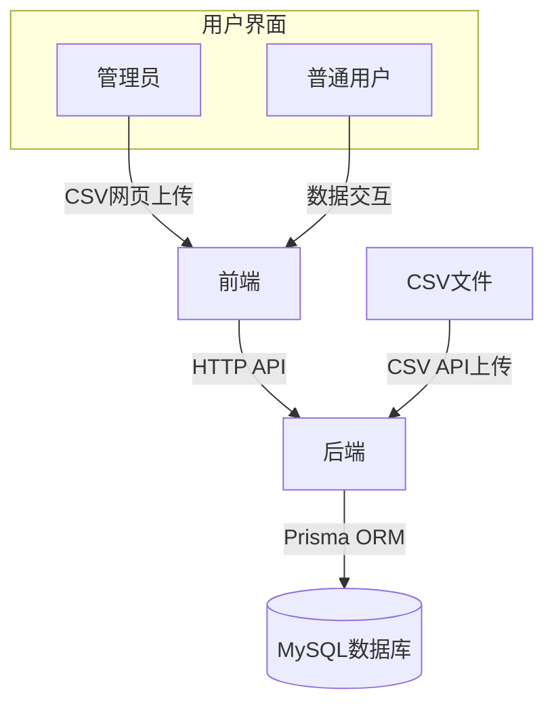
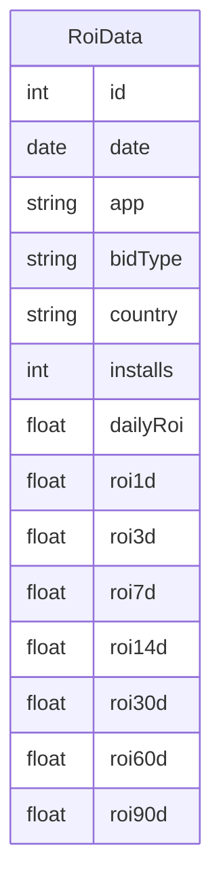

# 广告ROI数据分析系统设计文档

## 1. 系统架构图



## 2. 数据库设计

### 2.1 ER图


### 2.2 核心表结构
```prisma
model RoiData {
  id          Int      @id @default(autoincrement())
  date        DateTime @db.Date
  app         String
  bidType     String   @default("CPI")
  country     String
  installs    Int
  
  // ROI指标 (null表示数据缺失，0表示真实数值为0)
  dailyRoi    Float?    
  roi1d       Float?    
  roi3d       Float?    
  roi7d       Float?    
  roi14d      Float?    
  roi30d      Float?    
  roi60d      Float?    
  roi90d      Float?    
  
  @@index([app, country, date])
  @@index([date])
}
```

## 3. API接口规范

### 3.1 数据导入接口
- 路径: `POST /api/data/import`
- 请求格式: `multipart/form-data`
- 参数: `file` (CSV文件)
- 响应:
  ```typescript
  {
    success: boolean
    count: number
  }
  ```
- 错误码:
  - 400: 文件格式错误
  - 422: 数据验证错误
  - 500: 服务器错误

### 3.2 数据查询接口
- 路径: `GET /api/rois`
- 查询参数:
  - `app`: 应用名称
  - `country`: 国家地区
  - `startDate`: 开始日期(可选)
  - `endDate`: 结束日期(可选)
- 响应格式:
  ```typescript
  Array<{
    date: string
    app: string
    country: string
    installs: number
    roi: {
      daily: number | null
      day1: number | null
      day3: number | null
      day7: number | null
      day14: number | null
      day30: number | null
      day60: number | null
      day90: number | null
    }
  }>
  ```

### 3.3 统一错误响应
```typescript
{
  error: string       // 错误类型
  message: string     // 错误描述
  statusCode: number  // HTTP状态码
  details?: any       // 错误详情(可选)
  stack?: string      // 开发环境包含调用栈
}
```

## 4. 前端组件结构

```
App
├── ChartFilters (筛选条件组件)
├── DataImportButton (数据导入组件, 管理员特有)
└── ROITrendChart (ROI趋势图表组件)
```

## 5. 核心数据流向

```mermaid
sequenceDiagram
    participant 管理员
    participant 普通用户
    participant 前端
    participant 后端
    participant 数据库
    
    管理员->>前端: 网页上传CSV文件
    前端->>后端: POST /api/data/import
    后端->>数据库: 存储数据
    
    alt API直接上传
        管理员->>后端: POST /api/data/import
        后端->>数据库: 存储数据
    end
    
    普通用户->>前端: 查询ROI数据
    前端->>后端: GET /api/rois
    后端->>数据库: 查询数据
    数据库-->>后端: 返回结果
    后端-->>前端: 返回格式化数据
    前端->>普通用户: 展示图表
